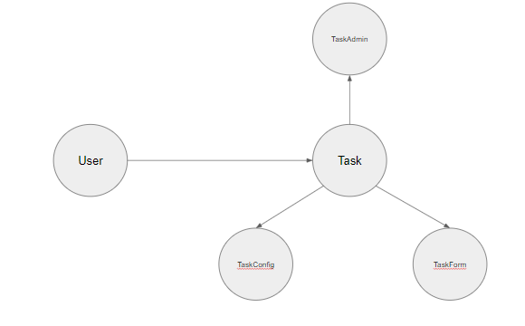

# Pasos para iniciar proyecto

Primero tener descargado sqlite e iniciar el ejecutable de sqlite3.
[Link de descarga del .zip](https://www.sqlite.org/2023/sqlite-tools-win-x64-3440200.zip)


1. `pip install -r requirements.txt`
2. `python manage.py makemigrations`
3. `python manage.py migrate`
4. `python manage.py createsuperuser`
5. `python manage.py runserver`
6. Ingresar a tu navegador en el puerto 8000 [http://127.0.0.1:8000/](http://127.0.0.1:8000/)


# FEATURE PROGRESS BAR 

Se agrego el feature de una barra de progreso de tareas completadas y por completar.

```python

@login_required
def tasks(request):
    tasks = Task.objects.filter(user=request.user, datecompleted__isnull=True)
    tasks_completed = Task.objects.filter(user=request.user, datecompleted__isnull=False)

    count_completed = tasks_completed.count()
    count_not_completed = tasks.count()

    return render(request, 'tasks.html', {"tasks": tasks, "count_total": count_completed + count_not_completed, "count_completed": count_completed})


@login_required
def tasks_completed(request):
    tasks = Task.objects.filter(user=request.user, datecompleted__isnull=False).order_by('-datecompleted')
    
    tasks_not_completed = Task.objects.filter(user=request.user, datecompleted__isnull=True)
    count_not_completed = tasks_not_completed.count()
    count_completed = tasks.count()
    
    return render(request, 'tasks.html', {"tasks": tasks, "count_total": count_completed + count_not_completed, "count_completed": count_completed})

```

### Test

Se hizo una prueba de test para comprobar que la barra de progreso exista.


```python
class TasksTestCase(LiveServerTestCase):
    def setUp(self):
        # Configuración del navegador Selenium (puedes ajustar según tus necesidades)
        chrome_options = Options()
        # chrome_options.add_argument("--headless")  # Ejecución en modo sin cabeza para pruebas en segundo plano
        self.selenium = webdriver.Chrome(options=chrome_options)
        self.selenium.implicitly_wait(10)  # Espera implícita de 10 segundos
        super(TasksTestCase, self).setUp()

    def tearDown(self):
        self.selenium.quit()
        super(TasksTestCase, self).tearDown()

    def test_tasks_page(self):
        # Crear un usuario y tareas para ese usuario
        user = User.objects.create_user(username='testuser', password='testpass')
        Task.objects.create(user=user, description='Task 1')

        # Acceder a la página de tareas con Selenium
        self.selenium.get(f'{self.live_server_url}/signup/')
        self.selenium.find_element(By.NAME, 'username').send_keys('mena3')
        self.selenium.find_element(By.NAME, 'password1').send_keys('123qweop')
        self.selenium.find_element(By.NAME, 'password2').send_keys('123qweop')
        self.selenium.find_element(By.NAME, 'password2').send_keys(Keys.ENTER)
    
        # Verificar que la página de tareas se carga correctamente
        self.assertIn('tasks', self.selenium.find_element(By.CSS_SELECTOR, "h1").text.lower())
        
        WebDriverWait(self.selenium, 10).until(
            EC.presence_of_element_located((By.TAG_NAME, 'progress'))
        )

        # Verificar que la tarea se muestra en la página
        progress_bar = self.selenium.find_element(By.TAG_NAME, 'progress')
        self.assertIsNotNone(progress_bar, 'Progress bar not found')


        WebDriverWait(self.selenium, 10).until(
            EC.presence_of_element_located((By.ID, 'progress-message'))
        )

        progress_message = self.selenium.find_element(By.ID, 'progress-message')
        self.assertIn('Tasks completed 0/0', progress_message.text)
```


# MODELO DE DOMINIO

El modelo de dominio se centra en el dominio de "Task", del cual se extienden otros modelos como "TaskAdmin", "TaskForm", y "TaskConfig", y también otro modelo "User" que administras las tasks.



## MÓDULO AUTH

Se agrego el módulo de "auth", en el que se incluyeron funciones como el "sigin", "signout", y "signup".

```python

def signup(request):
    if request.method == 'GET':
        return render(request, 'signup.html', {"form": UserCreationForm})
    else:

        if request.POST["password1"] == request.POST["password2"]:
            try:
                user = User.objects.create_user(
                    request.POST["username"], password=request.POST["password1"])
                user.save()
                login(request, user)  # Replace LoginFailure with login
                return redirect('tasks')
            except IntegrityError:
                return render(request, 'signup.html', {"form": UserCreationForm, "error": "Username already exists."})

        return render(request, 'signup.html', {"form": UserCreationForm, "error": "Passwords did not match."})


def signin(request):
    if request.method == 'GET':
        return render(request, 'signin.html', {"form": AuthenticationForm})
    else:
        user = authenticate(
            request, username=request.POST['username'], password=request.POST['password'])
        if user is None:
            return render(request, 'signin.html', {"form": AuthenticationForm, "error": "Username or password is incorrect."})

        login(request, user)
        return redirect('tasks')

@login_required
def signout(request):
    logout(request)
    return redirect('home')


```